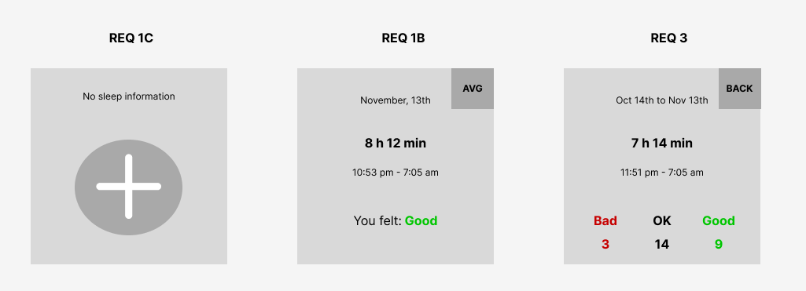

<p align="center">
    
</p>

<p align="center">
    <h1 align="center">SLEEP-LOGGER-API</h1>
</p>
<p align="center">
    <em><code>❯ Service designed to track and retrieve historical sleep data for users </code></em>
</p>
<p align="center">
	
	
	
</p>

<br>

#####  Table of Contents

- [ Overview](#overview)
- [ Repository Structure](#repository-structure)
- [ Features](#features)
- [ Getting Started](#getting-started)
    - [ How to Run](#how-to-run)
    - [ Tests](#tests)

---

##  Overview

The Sleep Log Application is a backend service designed to track and analyze sleep data for users. It enables users to log their sleep periods, feelings upon waking, and retrieve sleep-related statistics such as averages for the last 30 days

---

##  Repository Structure

```sh
└── sleep-logger-api/
    ├── challenge_requirements.docx
    ├── docker-compose.yml
    ├── resources
    │   └── wireframes.png
    └── sleep
        ├── Dockerfile
        ├── build.gradle
        ├── gradle
        ├── gradlew
        ├── gradlew.bat
        ├── settings.gradle
        └── src
```
---

##  Features

### 1. **Create Sleep Log**
   - **Endpoint**: `POST /sleep-log/{userId}`
   - **Description**: Allows a user to log their sleep details, including the time they went to bed, the time they woke up, and how they felt in the morning.

### 2. **Get Latest Sleep Log**
   - **Endpoint**: `GET /sleep-log/{userId}/latest`
   - **Description**: Retrieves the most recent sleep log recorded by the user.

### 3. **Get Sleep Averages**
   - **Endpoint**: `GET /sleep-log/{userId}/average?days={days}`
   - **Description**: Calculates and returns sleep data averages for a specified number of days (between 15 and 90 days).
---

##  Getting Started

### How to Run

Dockerfiles are set up for your convenience for running the whole project. You will need docker and ports 5432 (Postgres) and 8080 (API).

To run everything, simply execute `docker-compose up`. To build and run, execute `docker-compose up --build`.

This repository contains a postman collection with all the three endpoints for the features.

###  Tests

Execute the test suite using the following command:

```sh
❯ gradle test
```

##  Considerations

This API simulates the register considering that a person won't sleep more than 14 hours and that a person can go to sleep and wakeup in the same day. Also the migrations are not in separated env folders (dev, hml, prd) since it is a take home challenge

## Next Steps

- Change user_id to be an UUID
- Add annotations for validation
- Integration tests
- Change migrations to a enviroment folder